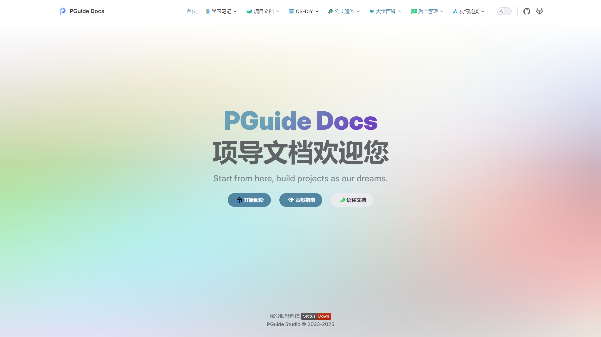

# 🌱 项导文档 - 共建知识花园

万物互联的时代，知识的传递如同满天星火。本项目的每一页文档，都是社区伙伴们智慧的结晶。在此诚邀您与我们携手，共同浇灌这株属于每个人成长的知识树👫

> 太好了，本文档已入选[Plume Vuepress案例](https://theme-plume.vuejs.press/demos/#%E6%96%87%E6%A1%A3)

## 文档内容

### 学习笔记

> 与他人[交流计算机学习心得](https://docs.pguide.studio/learning-notes/)！

### 项目文档

> 用想象力构建[梦想中的项目](https://docs.pguide.studio/project-docs/)

### CS-DIY

> 关于[计算机的小知识](https://docs.pguide.studio/cs-diy/)！！！灵感来源于[CSDIY](https://csdiy.wiki/)

### 公共服务

> 一些[公共服务及相关知识普及](https://docs.pguide.studio/public-service/)

### 大学百科

> 面对人生的十字路口，我们[该何去何从](https://docs.pguide.studio/campus-wiki/apply-student-email/)？

## 🌟 温馨贴士
**“当您在文字中发现星辰，也请为后来者点亮一盏路灯。”** — 您铺垫的每本书籍都是通往更美好开源世界的台阶

但一个人的力量始终是弱小的，项导文档欢迎您的加入，请参考[贡献指南](https://docs.pguide.studio/contribute/)。

---

## 🌈 星光留言板
> "我们不是在编写代码，而是在编织联结世界的网络" —— 期待您的第一次贡献！遇到任何未知星域，欢迎在Issues发射信号弹~

每篇文档的下方都设置了评论区，使用[walline](https://comment.pguide.studio/ui)登录后可以参与互动哟。

--- 

## 常见问题

### 感觉加载卡卡的？

上线前我们测试过啦，针对静态资源和边缘访问都做了大量优化，一般不会出大问题，如果内容没更新就刷新一下叭，可能是浏览器缓存的原因。
