:::info V1.7.18.20250624_rc
最新修订时间为 2025年6月24日0:17
:::

首先感谢您的无私奉献，项导文档基于Vuepress的[plume主题构建](https://theme-plume.vuejs.press/)
，由多名成员共同维护，内容完全开源。

<RepoCard repo="Lyrlark/PGuide-Docs"></RepoCard>

## 我是文档的编写者

项导文档使用markdown语法进行编写，首先得大概掌握下[markdown基础语法](/csdiy/tools-must/markdown/)

在您完成markdown类型文档编写后可以

- 通过github创建合并请求
- email到[我们的邮箱](mailto:losmosga@foxmail.com)
- QQ发送给 [rand777](https://qm.qq.com/cgi-bin/qm/qr?k=9s5V15fEzwzHuawmc-QQZ615NPTp9oEZ)

### 我想直接写一篇文档

不想这样麻烦也可以的，联系[rand777](https://qm.qq.com/q/2iLBaNcsnO)
并获取语雀编辑权限，或将word文档/PDF文档/PPT发送给[rand777](https://qm.qq.com/q/2iLBaNcsnO)
。我们会将您的文档转换为markdown格式并发布到项导文档站，按照您的要求对其进行署名。

### 其他注意事项

请参考[文档编写规范](/contribute/#文档编写规范)

## 我是文档站的开发者

在参与合作开发之前，您需要了解的一些基础知识:

:::info 基础知识

[::material-icon-theme:git:: git的使用](/csdiy/tools-must/git/)

[::octicon:markdown-16:: markdown基础语法](/csdiy/tools-must/markdown/)

[::https://theme-plume.vuejs.press/plume.png::  VuePress Plume主题](https://theme-plume.vuejs.press/guide/intro/)

:::

随后，QQ联系 [rand777](https://qm.qq.com/q/2iLBaNcsnO) 加入项导文档github开发组。

:::tip 联系格式
我需要知道您的身份，并且想要参与编写哪部分。
:::

### 项目结构

先大致了解下项目的结构

::: file-tree title="项目结构"
- .github
  - ISSUE_TEMPLATE #issue模板
      - ++ bug_report.md #bug报告模板
      - ++ feature_request.md #功能请求模板
- docs
    - .vuepress
        - .cache #缓存文件夹
            - …
        - .temp #临时文件夹
            - …
        - public #静态资源文件夹
            - avatar #头像文件夹
                - …
            - icon #矢量图标文件夹
                - …
            - src #图片文件夹
                - …              
        - theme #主题设置文件夹
            - style #主题自定义文件夹
                - custom.css #自定义主题
            - shim.d.ts #自定义vue组件导入
        - client.ts #客户端配置
        - config.ts #全局功能配置
        - navbar.ts #导航栏配置
        - notes.ts #笔记配置
        - plume.config.ts #主题选项配置
    - notes
        - CS-DIY #计算机自学指南
            - …
        - 公共服务 #项导公开的服务
            - …
        - -- 后台管理 #后台管理界面（已删除）
            - …
        - 大学百科 #大学百科全书
            - …
        - 学习笔记 #学习笔记荟萃
            - …
        - 项目文档 #包含项目的介绍、人员等
            - …
        - begin.md #“开始阅读”页
        - contribute.md #“贡献”页
        - friends-organizations.md #友情链接-组织页
        - friends-persons.md #友情链接-个人页
        - friends-quotes.md #友情链接-常见问题页
        - Templates.md #Vuepress Plume模板页
        - ++ update-note.md #更新日志页
    - README.md #首页
- .gitattributes #git属性设置
- .gitignore #不进行git的文件(夹)
- .npmrc #npm包管理设置
- package.json #所有npm包依赖
- pnpm-lock.yaml #所有pnpm包依赖
- README.md #中文项导文档介绍
- README-en.md #英文项导文档介绍
- ++ vercel.json #Vercel部署配置
- …
:::

---

### 配置开发环境

:::info 开发环境

支持跨平台开发：::logos:microsoft-windows-icon size=1.5em:: ::wpf:macos size=1.5em:: ::flat-color-icons:linux size=1.5em::

---
推荐配置：
- ::file-icons:intel size=1.5em::Intel i5-12400或::file-icons:amd size=1.5em::AMD Ryzen 5 3600X及以上
- ::bi:memory size=1.5em::16GBDDR4或LPDDR4X内存及以上
- ::material-symbols:hard-disk-sharp::500G SSD或NVMe固态硬盘

---
软件需求：
- ::devicon:webstorm size=1.5em::WebStorm或::vscode-icons:file-type-vscode size=1.5em::VS Code
- ::vscode-icons:file-type-node size=1.5em::Node.js LTS 22.16.0(2025年6月23日)
- ::material-icon-theme:git size=1.5em::git
:::

1. 下载WebStorm

这个软件是咱们主要写代码的地方，软件本身用于前端开发，您可以[在这里](/campus-wiki/common-softwares/IDE/WebStorm/)
详细了解。其他同类型的开发软件，如VS Code，也可以。

==如果你对上面的软件不太清楚==，请先完成[学生邮箱申请](/campus-wiki/apply-student-email/)
并申请JetBrains教育版。下载WebStorm可以到 [WebStorm官方网站](https://www.jetbrains.com/zh-cn/webstorm/)
或 [Alist动态开源软件镜像站](http://192.168.183.171:5244/softwares/JetBrainsIDEs/WebStorm-2024.3.4.exe)
下载

2. 下载NVM

我们在进行开发的时候，需要一个服务端来支撑web应用的运行，Node.js是目前非常流行的开源web服务器运行时环境。在运行不同的前端项目时，往往需要的node.js版本是不一样的，而
NVM（全名：Node.js Version Manager）可以帮助我们更高效地管理不同的node.js版本和依赖环境。

软件安装及应用教程看[这里](/csdiy/study-path/front-dev/NVM/)，不要忘记安装长期支持版npm哦！

> 安装完成后记得重启IDE和终端以重载环境变量,若github无法加载，需下载Watt Toolkit加速后即可。

3. 导入项目

git使用HTTPS协议导入
> 导入失败请参考“[常见问题及解决方案](#git推送-ssl-error)”

:::tabs

@tab 从Github克隆（推荐）

   ```shell
   git clone https://github.com/PGuideDev/PGuide-Docs.git
   ```

@tab 从Gitlab CQMU克隆

   ```shell
   git clone https://git.cqmu.edu.cn/PGuideDev/pguide-docs.git
   ```

:::

git也可以使用SSH协议导入，需要[配置SSH](/csdiy/tools-must/git/#设置ssh密钥)
和[github设置](/csdiy/tools-must/git/#github设置)

:::tabs

@tab 从github克隆

   ```shell
   git clone git@github.com/PGuideDev/PGuide-Docs.git
   ```

@tab 从Gitlab CQMU克隆

   ```shell
   git clone git@git.cqmu.edu.cn/pguide-studio/pguide-docs.git
   ```

:::

如果您已在开发者行列中，打开WebStorm后，直接在WebStorm上点击“克隆仓库（Clone Repository ）”，登录github账号进行导入


4. 安装项目依赖

安装 pnpm

在WebStorm终端中输入

```shell
npm install -g pnpm
```

安装好后，再输入

```shell
pnpm install
```

这样就完成了项目依赖的安装

5. 启动本地开发环境

终端中输入

```shell
pnpm run docs:dev
```

打开[http://localhost:8080](http://localhost:8080)即可访问本地的开发环境了。代码修改时，内容也会一起跟着改。

6. 项目设置

将 `.cache` `.temp` `.public` 文件夹设置为排除（路径：docs/.vuepress/)

> 避免IDE错误识别缓存TODO、svg命名空间错误

@[artPlayer](https://cos.pguide.cloud/docs/2025-03-10_03-56-14.mp4)

7. 阅读开发规范章

请合作开发者依次阅读 [`Git规范`](/contribute/#git规范)、
[`静态资源管理规范`](/contribute/#静态资源管理规范)、[`文档编写规范`](/contribute/#文档编写规范)、
[`常见问题及解决方案`](#🆘-常见问题及解决方案)

### 合作开发流程

> rand777向成员派发TODO任务，各成员更新main分支，并Rebase到自己的开发分支，完成任务后提出PR并在开发群内通知rand777进行审核

```mermaid
graph TD
    A[rand777派发TO DO任务] --> B[成员更新main分支]
    B --> C[Rebase到自己的开发分支]
    C --> D[开发完成任务]
    D --> E[创建合并请求并群内通知]
    E --> F[Code Reviewer审核PR]
    F --> G{审核通过?}
    G -->|是| H[合并到main分支]
    G -->|否| D
    H --> A
```



## Git规范

:::info git学习
我不知道[git是什么](/csdiy/tools-must/git/)
:::

项导文档开发Git规范采用 [::logos:angular-icon:: Angular 规范](https://zj-git-guide.readthedocs.io/zh-cn/latest/message/Angular%E6%8F%90%E4%BA%A4%E4%BF%A1%E6%81%AF%E8%A7%84%E8%8C%83/)

### 提交规范

采用 **[Conventional Commits](https://zj-git-guide.readthedocs.io/zh-cn/latest/message/Conventional%E6%8F%90%E4%BA%A4%E8%A7%84%E8%8C%83/)** 标准：

| 类型         | 说明                   | 示例                                                      |
|------------|----------------------|---------------------------------------------------------|
| `feat`     | 新功能，比如引入了PDF导入       | feat: add @vuepress-plume-theme/pdf function            |
| `fix`      | Bug 修复，比如不显示图标了      | fix(chore): fixed the version caused icon display error |
| `docs`     | 文档更新                 | docs(update-note.md): update the doc                    |
| `style`    | 代码格式（空格、分号等）         | style: pep8 formatted                                   |
| `refactor` | 代码重构，比如把图片A换为图片B     | refactor: change A2B                                    |
| `perf`     | 性能优化，比如删除了大图片        | perf(src/*.img): upload2oss                             |
| `test`     | 测试相关，比如测试跨域访问        | test(CORS): add 3rd party auth                          |
| `chore`    | 构建/工具变更，比如ESlint配置修改 | chore(eslint): update es@1.0.0 to es@1.0.1              |

**示例**：

:::tabs

@tab WebStorm中提交


@tab 终端中提交

```bash
git add .
git commit -m "feat: 添加用户登录功能"
```

:::

### WebStorm拉取开发分支

1. 确保已克隆仓库（如果您已经有仓库，直接进入下一步）

如果未克隆远程仓库，可按照以下步骤进行操作：

> 打开WebStorm，点击File → New → Project from Version Control
>
> 选择git，输入仓库URL，完成后等待WebStorm拉取代码

2. 牵出开发分支

每个人单独一条开发分支，以 `dev/你的名字某字母`定义，例如彭于晏的开发分支为 `dev/pyy`


3. 提交分支到远程仓库

:::important 远程仓库
统一提交到github，新开发者有一个`新`的标签
:::


::: warning 其他注意事项

- 开发分支在main分支签出，不要在其他人的dev分支拉取
- `feat fix chore test` 分支在开发完并且合并请求通过后，请自行删除！
    - 成员完成阶段性开发后，如涉及功能性更改，请自行迁出test测试分支，再请求合并到main分支

:::

**合并要求**：

- 通过 Pull Request 合并到 `main`
- 至少一个团队成员 Code Review
- 通过所有 CI 测试项
    - Vercel CI自动测试，我会尝试修复，基本不用管

### 分支策略

| 分支类型      | 描述          | 命名示例                  |
|-----------|-------------|-----------------------|
| `main`    | 稳定生产版本      | -                     |
| `dev/*`   | 集成开发分支，每人一条 | 彭于晏的开发分支是`dev/pyy`    |
| `feat/*`  | 功能开发分支      | `feat/user-auth`      |
| `fix/*`   | Bug 修复分支    | `fix/mobile-layout`   |
| `chore/*` | 配置/工具调整     | `chore/eslint-config` |
| `test/*`  | 测试功能分支      | `test/refactor-icon`  |

## 文档编写规范

### 内容规范

- 文档统一使用markdown格式，创建在`docs\notes`
  对应文件夹下，请注意修改永久链接[permalink](/contribute/#permalink)
- VuePress Plume主题默认从二级标题开始，右侧侧边栏只渲染到三级标题
- 每行markdown请空一行

### 新增页面

在 `docs/` 下创建 .md 文件，按约定式路由生成路径。

创建一篇新文档后，需要关注开头的这几行

```markdown{4}
---
title: #文章标题
createTime: #创建时间（自动生成）
permalink: #永久链接
icon: #可选项，侧边栏图标
---
```

### permalink

注意更新permalink，要和同级目录相同的前缀；

例如：

/campus-wiki/prefixA/pageA/

/campus-wiki/prefixA/pageB/

---

### 创建拉取请求Pull Request

在完成所在分支任务后，需要创建合并请求才能将更改应用到生产环境，下面是两种创建PR的方式

:::tip
需要先在自己的分支commit并push到远程仓库哦，创建完成后记得在群内或者单独给rand777发个消息
:::

:::tabs

@tab ::devicon:webstorm:: WebStorm创建


@tab ::line-md:github-loop:: Github创建

<LinkCard icon="line-md:github-loop" href="https://github.com/Lyrlark/PGuide-Docs/pulls" title="Create Pull Request" >
PGuide Docs Github Page</LinkCard>


:::

### 徽章badge使用规范

1. 整理中的文档、服务使用`badge: {type: 'warning', text: '整理中'}`；
2. 维护中的文档、服务使用`badge: {type: 'danger', text: '维护中'}`
3. 已完成的文档、服务可使用`badge: {type: 'success', text: '概要'}`；
4. 即将上线的文档、服务使用`badge: {type: 'info', text: '即将上线'}`；


## 静态资源管理规范

这里是为了规范您的**图片、视频、PDF、矢量图**引用方法，Plume Vuepress推荐你引用静态资源的方式如下（非必要）：

```markdown
#使用相对public的路径
[image](/src/yyyy-mm-dd_hh-min-sec.png)
```

:::info 静态资源类型、大小规范

- 图片文件：70%分辨率jpg或png图片，放入 `PGuide-Docs/.docs/.vuepress/public/src`
  中，图片命名方式参考[截图工具设置](/contribute/#截图工具设置)
- 矢量图：.svg .eps文件，放入 `PGuide-Docs/.docs/.vuepress/public/src`中，命名为英文即可

---

- 视频文件：.mp4文件，帧率16/24FPS，放入项导腾讯云对象存储，参考[对象存储](/contribute/#对象存储)
- PDF文件：请尽量精简，不需要的页面不上传，放入项导腾讯云对象存储，参考[对象存储](/contribute/#对象存储)

  :::

### 截图工具设置

::: steps

1. 下载pixpin

前往[Pixpin官网](https://pixpin.cn/)下载并安装该软件


2. 配置pixpin

右键任务栏中的pixpin图标（没有的话看看上拉键），点击配置


点击开机后自动启动

转到WebStorm，找到src文件夹，右键open in -> explorer


进入src文件夹，找到上方地址栏，复制绝对地址


回到Pixpin，转到保存


- 设置保存图像质量80
- 手动、快速保存路径删除`Pixpin_`前缀
- 更改文件夹，粘贴刚才复制的绝对地址

转到快捷键/动作

删除所有快捷键，添加新动作

截图设置为F1，删除其他的

添加新动作，动作名称选截图并快速保存，设置为F2

:::

### 对象存储

所有**PDF、.mp4视频**放在项导腾讯云对象存储上，如有此类文件，将其发送给 rand777，链接处留空，并留下以下格式的TODO

> 今天天气多么好呀，于是我打开了高等数学
> 这里==需要PDF文件==

然后写上TODO: 需要{文件名.pdf}，并`ctrl`+`/`注释，在代码里看起来是这样的：

```text
今天天气多么好呀，于是我打开了高等数学
[//]: # (TODO: 需要高等数学.pdf)
```

## 常见问题及解决方案

### git推送 SSL ERROR

> [参考magic配置三方代理](/csdiy/tools-must/magic/clash-core/)
> 
> [参考host配置本机正向代理](/csdiy/tools-must/magic/host/)

git配置本地代理，此处默认您的代理端口在本地且 http/https 端口号为7890

```shell
# 设置全局 HTTP 代理
git config --global http.proxy http://127.0.0.1:7890

# 设置全局 HTTPS 代理
git config --global https.proxy http://127.0.0.1:7890
```

### 依赖版本错误

每个rc版本的依赖包可能会有不同的版本要求，您可以尝试以下步骤：

:::steps

1. 找到冲突的依赖包
   
2. 在终端中输入以下命令，强制安装指定版本的依赖包

```bash
pnpm add @<package-name/subpackage>@<version>
```

例如

```shell
pnpm add @vuepress/shiki-twoslash@2.0.0-rc.110
```

:::

3. 再次启动应用

```shell
pnpm run docs:dev
```

### 长期未更新安装不了包

可以尝试去缓存启动web应用

```shell
vuepress dev docs --clean-cache --clean-temp
```

先删除`docs/.vuepress/.temp`, `docs/.vuepress/.cache`和`node_modules`文件夹，然后重新安装依赖

```shell
pnpm i
```


## 附录

### 参考链接

- [Plume 主题配置指南](https://theme-plume.vuejs.press/)
- [pnpm 使用手册](https://pnpm.io/zh/motivation)
- [VuePress 官方文档](https://vuepress.vuejs.org/)