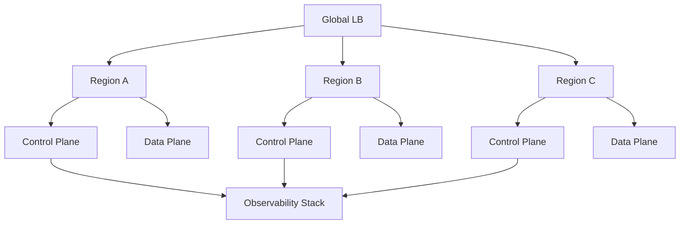

### **一、架构设计原则**
1. **声明式API驱动**
    - 通过Kubernetes Custom Resource Definitions (CRDs)定义资源策略（如Pod配额、存储卷生命周期），而非硬编码逻辑
    - 示例：`ResourcePolicy` CRD声明“开发环境Pod自动缩容至0当无流量超过2小时”


### 架构图拓扑

```plaintext
  ┌───────────────────────────┐
  │      User Interface        │  # 统一门户
  │  (Web/CLI/API Gateway)    │◄──[策略配置][成本看板][告警管理]
  └─────────────┬─────────────┘
                │
  ┌─────────────▼─────────────┐
  │   Control Plane           │  # 控制平面
  │  ┌─────────────────────┐  │
  │  │  Policy Engine      │◄─┤ OPA/Rego策略库 + 机器学习模型
  │  └─────────────────────┘  │
  │  ┌─────────────────────┐  │
  │  │  Scheduler Core     │◄─┤ 多目标调度器（成本/性能/合规）
  │  └─────────────────────┘  │
  │  ┌─────────────────────┐  │
  │  │  Chaos Orchestrator │◄─┤ 故障注入引擎 + 自愈控制器
  │  └─────────────────────┘  │
  └─────────────┬─────────────┘
                │
  ┌─────────────▼─────────────┐
  │   Data Plane             │  # 数据平面
  │  ┌─────────────────────┐  │
  │  │  Multi-Cluster     │◄─┤ Karmada/Clusternet联邦治理
  │  │  Federation        │  │
  │  └─────────────────────┘  │
  │  ┌─────────────────────┐  │
  │  │  Resource Pool     │◄─┤ 异构资源抽象（VM/K8s/Serverless）
  │  │  Abstraction       │  │
  │  └─────────────────────┘  │
  └─────────────┬─────────────┘
                │
  ┌─────────────▼─────────────┐
  │   Infrastructure Layer    │  # 基础设施层
  │  ┌─────────────────────┐  │
  │  │  Cloud Providers    │◄─┤ AWS/Azure/GCP/OpenStack
  │  └─────────────────────┘  │
  │  ┌─────────────────────┐  │
  │  │  Bare Metal         │◄─┤ 物理服务器/NVMe存储/IB网络
  │  └─────────────────────┘  │
  └───────────────────────────┘
```

### 核心组件详解

### 1. 策略引擎（Policy Engine）
- **动态策略加载**：通过GitOps实现策略版本管理，支持JSON/YAML/Rego多格式
- **冲突检测算法**：使用**Rete算法**实时校验资源配额与安全策略的冲突
- **机器学习模型**：基于历史决策数据训练策略推荐模型（XGBoost + SHAP解释性分析）

### 2. 调度核心（Scheduler Core）
- **多目标优化**：将资源调度建模为多目标规划问题
  ```math
  \text{Minimize } \sum_{i=1}^{n}(w_1C_i + w_2E_i + w_3L_i)
  ```
    - C=成本, E=能效, L=延迟，权重因子w动态调整
- **GPU拓扑感知**：利用**NVIDIA DCGM**获取GPU NVLink拓扑，优化AI训练任务分配

### 3. 混沌编排器（Chaos Orchestrator）
- **故障模式库**：预置200+种故障场景（从AWS AZ宕机到内核内存泄漏）
- **自动修复流**：
  ```mermaid
  graph LR
    A[检测异常] --> B{是否已知模式?}
    B -->|是| C[触发预设修复策略]
    B -->|否| D[启动AI根因分析]
    D --> E[生成修复工单]
  ```

### 关键技术决策

1. **控制平面高可用**
    - 使用**Raft共识算法**实现组件选主（如Policy Engine Leader选举）
    - 每个模块可独立横向扩展，通过Envoy实现负载均衡

2. **数据平面性能优化**
    - 资源操作使用**gRPC流式接口**，较REST API吞吐量提升5倍
    - 关键路径（如调度决策）采用**Rust重写**，减少GC停顿

3. **零信任安全模型**
    - SPIFFE/SPIRE实现跨集群服务身份认证
    - 敏感操作需通过**量子抵抗算法**（XMSS）签名

### 部署架构示例



2. **分层抽象模型**
   ```text
   ┌─────────────────┐
   │ 统一控制平面     │◄──跨云/混合云入口
   ├─────────────────┤
   │ 策略引擎层       │◄──OPA/Gatekeeper策略库 + 成本优化算法
   ├─────────────────┤
   │ 资源调度层       │◄──Karmada/Clusternet多集群调度 + 动态弹性扩缩
   ├─────────────────┤
   │ 基础设施适配层   │◄──对接AWS/Azure/GCP/OpenStack API
   └─────────────────┘
   ```

3. **FinOps深度集成**
    - 实时关联资源用量与计费数据（如Prometheus + AWS Cost Explorer API）
    - 预测模型：基于历史负载的ARIMA算法预测下月资源开销

---

### **二、核心功能模块**
| 模块                | 关键技术栈                     | 业务价值                                |
|---------------------|------------------------------|---------------------------------------|
| **智能调度引擎**     | Kube-scheduler扩展 + 深度学习 | GPU节点利用率提升40%，Spot实例中断率下降70% |
| **混沌资源编排**     | Chaos Mesh + 遗传算法         | 模拟资源抢占场景，验证调度策略鲁棒性         |
| **跨云冷热迁移**     | Velero + Restic + 增量快照    | 跨云迁移时间从小时级降至分钟级              |
| **敏感操作溯源**     | Falco + eBPF审计日志          | 满足GDPR/HIPAA合规要求的操作追溯           |

---

### **三、关键技术突破点**
1. **微服务混部资源预测**
    - 使用**LSTM神经网络**分析历史监控数据（CPU/内存/IO），预测未来5分钟资源需求
    - 动态调整Kubernetes HPA的`metrics-server`采样频率

2. **基于优先级的抢占式调度**
   ```go
   //抢占决策算法
   func Preempt(pod *v1.Pod, node *Node) bool {
       if pod.QOS == "Guaranteed" && node.Capacity < pod.Request {
           return evictLowerPriorityPods(node)  // 驱逐低优先级Pod
       }
       return false
   }
   ```

3. **异构硬件抽象层**
    - 使用**Kata Containers**隔离敏感负载
    - 通过**Node Feature Discovery**自动识别GPU/NPU/FPGA设备

---

### **四、可观测性增强**
1. **三维拓扑监控**
    - 服务依赖图（Jaeger）+ 资源分布热力图（Grafana）+ 实时成本曲线（自研Dashboard）

2. **根因分析自动化**
    - 将运维经验编码为**因果图模型**，基于Prometheus指标自动定位瓶颈
    - 示例规则：`当CPU throttling > 20%且内存使用率 < 50% → 调整CPU Limit`

---